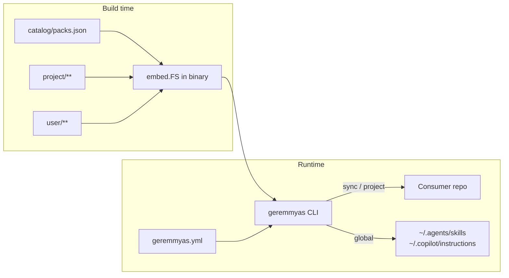

# geremmyas architecture

geremmyas is a Go CLI that ships Copilot agent content as **packs**. At build
time, `catalog/`, `project/`, and `user/` are embedded into the binary. At
runtime, the CLI copies selected pack files into a target repository or into
user-level VS Code paths.

## Repository layout

```text
cmd/geremmyas/          CLI entrypoint
internal/cli/           Commands, catalog, config, sync, global install
catalog/packs.json      Pack manifest (names, depends, source → target)
project/                Canonical files synced into consumer repos
user/                   Embedded prompts/bootstrap (not copied by project sync)
assets.go               //go:embed catalog/** project/** user/**
```

### Maintainer repo vs consumer repo

This repository **dogfoods** content without running `geremmyas project`:

| Path at repo root | How it maps |
| --- | --- |
| `AGENTS.md` | Symlink → `project/AGENTS.md` |
| `.github/agents`, `hooks`, `instructions`, `skills` | Symlinks → `project/.github/…` |
| `.github/copilot-instructions.md` | Symlink → `project/.github/copilot-instructions.geremmyas.md` (maintainer only) |
| `project/.github/copilot-instructions.md` | Generic template; synced by `core` pack to consumers |

Edit under `project/`; the root symlinks stay in sync. Do **not** run
`geremmyas project` here — sync would replace symlinks with plain copies and
fork the canonical tree.

Consumer repos use `geremmyas.yml` + `geremmyas sync` (or `geremmyas project`)
to copy from the embedded filesystem, not from your local checkout paths.

## Embedded filesystem

```go
//go:embed catalog/** project/** user/**
var EmbeddedFiles embed.FS
```

Implications:

- Pack `source` paths in `catalog/packs.json` must exist under those trees.
- Changing `project/` or `catalog/` requires **rebuilding** the binary for local
  testing (`go build ./cmd/geremmyas`).
- Released binaries only include what was embedded at release build time.

Run `geremmyas doctor` to verify every pack source path is present in the embed.

## Configuration

`geremmyas.yml` in the target repository:

```yaml
version: 1
packs:
  - core
  - sdd
```

- Default packs for non-interactive `init`: `core`, `sdd`.
- `add` / `remove` only edit this file; they do **not** sync files.
- `sync` and `project` read the config, resolve dependencies, then copy files.

## Pack resolution

`catalog/packs.json` lists packs with optional `depends`. When you request
`nestjs`, the CLI resolves the chain (for example `nestjs` → `node-api` →
`typescript-base`) and installs all required packs in dependency order.

Duplicate `target` paths across packs: the first copy wins; later copies count
as `skipped`.

## Project sync (`sync`, `project`)

For each pack file entry:

- **File** — copy `source` → `target` under the current working directory.
- **Directory** — walk all files recursively (skills, hooks, agents).

### Sync summary counters

| Counter | Meaning |
| --- | --- |
| `installed` | New file on disk |
| `updated` | Existing file overwritten |
| `preserved` | Customizable file left unchanged (content differed, no `--force`) |
| `skipped` | Unchanged content, or duplicate target already copied |

### Customizable targets

Unless `--force`, these paths are **not** overwritten when local content differs:

- `AGENTS.md`
- `specs/README.md`
- `mise.toml`
- `.github/copilot-instructions.md`
- `.github/hooks/guardrails-rules.txt`

Everything else (skills, instructions, agents, etc.) is updated when the embed
differs.

`geremmyas project` = update `geremmyas.yml` + run sync. Interactive `project`
can ask once whether to force-overwrite customizable files.

## Global install (`global`)

Copies only targets that map to user-level paths:

| Project target prefix | Installed to |
| --- | --- |
| `.github/skills/` | `~/.agents/skills/` |
| `.github/instructions/` | `~/.copilot/instructions/` |

Not installed globally: `AGENTS.md`, `mise.toml`, agents, hooks,
`copilot-instructions.md`, `specs/README.md`, templates.

Global install **always overwrites** (no preserve list). Use for skills and
instructions you want in every workspace.

## `user/` directory

Embedded but **not** installed by `sync` / `project`. Contains optional global
bootstrap (`user/copilot-instructions.md`) and prompts (`user/prompts/*.md`).
Copy or reference these manually if you use them outside pack sync.

## CI and releases

- **CI** (`ci.yml`): tests on changes to Go and catalog paths.
- **Release** (`release.yml`): release-please bumps version, tags, builds
  cross-platform binaries, uploads to GitHub Releases.
- **geremmyas.yml** workflow: build matrix on PR/push (subset of paths).

Breaking releases: use Conventional Commits with `feat!:` or `BREAKING CHANGE:`
in the commit body; release-please bumps the major version.

## Mental model


