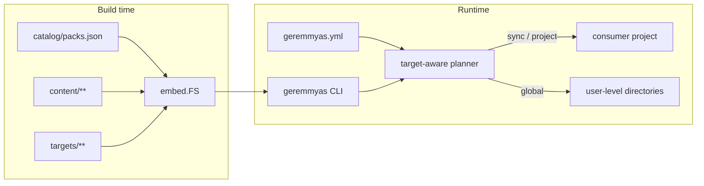

# geremmyas architecture

geremmyas is a Go CLI that distributes coding-assistant content as packs. The
catalog describes semantic artifacts; target adapters decide where each
artifact is materialized for Copilot, Codex, Cursor, Claude Code, or OpenCode.

## Repository layout

```text
cmd/geremmyas/          CLI entrypoint
internal/cli/           Commands, catalog, planning, sync, and global install
catalog/packs.json      Pack manifest (kind, source, target-neutral path)
content/                Canonical assistant-neutral content
targets/                Assistant-specific adapters and templates
assets.go               //go:embed catalog/** content/** targets/**
```

`content/` owns portable contracts, skills, instructions, roles, prompts,
templates, guardrails, and tooling. `targets/<assistant>/` exists only when an
artifact or runtime integration is genuinely assistant-specific. This prevents
the source tree from treating `.github/` as the universal content model.

### Maintainer repo vs consumer repo

This repository dogfoods the same sources without running `geremmyas project`:

| Root path | Canonical source |
| --- | --- |
| `AGENTS.md` | `content/AGENTS.md` |
| `.github/agents`, `instructions`, `skills` | `content/` |
| `.github/hooks` | `targets/copilot/hooks/` |
| `.github/copilot-instructions.md` | `targets/copilot/maintainer-instructions.md` |

GitHub platform files such as workflows and issue templates remain in
`.github/`; their location is a GitHub convention, not assistant coupling.
Edit the canonical source rather than its root symlink. Do not run project sync
in this repository.

## Embedded filesystem and catalog

```go
//go:embed catalog/** content/** targets/**
var EmbeddedFiles embed.FS
```

Each catalog entry has:

- `kind`: semantic type such as `skill`, `instruction`, `agent`, `hook`, or
  `contract`;
- `source`: embedded source path;
- `path`: target-neutral relative name used by the materializer.

There is no consumer destination in the catalog. Rebuild the binary after
changing embedded content, and run `geremmyas doctor` to validate sources and
artifact metadata.

Pack dependencies are resolved in dependency order. Duplicate semantic
artifacts are deduplicated before target planning.

## Configuration

```yaml
version: 1
packs:
  - core
  - sdd
targets:
  - copilot
  - codex
```

- Default packs for non-interactive `init`: `core`, `sdd`.
- Default target when omitted: `copilot`, for compatibility.
- Valid targets: `copilot`, `codex`, `cursor`, `claude-code`, `opencode`.
- `add` and `remove` edit configuration only.
- `sync` and `project` resolve packs and materialize the selected target union.

## Project materialization

Portable sources can appear at different destinations:

| Target | Principal project outputs |
| --- | --- |
| Copilot | `.github/skills`, `.github/agents`, `.github/instructions`, `.github/hooks` |
| Codex | `.agents/skills`, `.agents/roles`, `.codex/instructions`, `.codex/AGENTS.md` |
| Cursor | `.agents/skills`, `.agents/roles`, `.cursor/agents`, `.cursor/rules`, `.cursor/hooks.json` |
| Claude Code | `.agents/skills`, `.agents/roles`, `.claude/agents`, `.claude/instructions`, `CLAUDE.md` |
| OpenCode | `.agents/skills`, `.agents/roles`, `.opencode/agents`, `.opencode/instructions`, `.opencode/AGENTS.md` |

`AGENTS.md`, `mise.toml`, and selected templates are shared project outputs.
Mixed target selection produces the union, so Copilot paths appear only when
Copilot is selected.

Generated adapter files include `geremmyas:generated`. Customized generated
files are preserved unless `--force` is used.

### Project ownership and reconciliation

Project state is recorded in `.geremmyas/project-manifest.json`. It stores the
selected packs, targets, destination paths, and hashes written by Geremmyas.
Each sync computes the complete desired state and removes obsolete files only
when they are still unchanged and owned.

Modified, unowned, and symlinked files are preserved. A missing manifest adopts
only exact matches for known legacy Geremmyas outputs. A corrupt or unsupported
manifest stops the operation before files are copied. Destination traversal is
symlink-safe and will not write through a selected target path.

### Sync summary

| Counter | Meaning |
| --- | --- |
| `installed` | New file |
| `updated` | Owned or forced file replaced |
| `preserved` | Local content intentionally left unchanged |
| `skipped` | Content already current or duplicate output |

`geremmyas project` updates `geremmyas.yml` and then performs the same sync.

## Global materialization

`geremmyas global [--targets ...] [--force] <pack>...` treats each invocation
as the complete desired global state:

| Target | Principal global outputs |
| --- | --- |
| Copilot | `~/.agents/skills`, `~/.copilot/instructions` |
| Codex | `~/.agents/skills`, `~/.codex/instructions`, `~/.codex/AGENTS.md` |
| Cursor | `~/.agents/skills`, `~/.cursor/rules`, `~/.cursor/hooks.json` |
| Claude Code | `~/.agents/skills`, `~/.claude/CLAUDE.md` |
| OpenCode | `~/.agents/skills`, `~/.config/opencode/AGENTS.md` |

Copilot instructions are written only when Copilot is selected. Codex
instructions are written only when Codex is selected. Mixed selection produces
their union.

Global ownership is recorded at
`${XDG_STATE_HOME:-$HOME/.local/state}/geremmyas/global-manifest.json`.
Reconciliation follows the same conservative rules as project sync: only
unchanged owned files are removed, unknown files are never claimed, and corrupt
manifests fail before mutation.

## Context diagnostics

`geremmyas context` inventories embedded catalog skills, current project
skills, `~/.agents/skills`, Codex system skills, and the Codex plugin cache.
Filesystem walks do not follow symlinks. Managed global paths come from the
ownership manifest; system and plugin paths are observed only.

Frontmatter cost uses `(bytes + 3) / 4` as a deterministic comparison metric,
not an exact model tokenizer result.

## CI and releases

- `ci.yml` runs Go tests, structural checks, skill lint, and shell checks.
- `release.yml` uses release-please and builds cross-platform binaries.
- Breaking changes use `feat!:` or a `BREAKING CHANGE:` footer.

## Mental model


```mermaid
flowchart LR
  subgraph build [Build time]
    catalog[catalog/packs.json]
    content[content/**]
    adapters[targets/**]
    embed[embed.FS]
    catalog --> embed
    content --> embed
    adapters --> embed
  end
  subgraph runtime [Runtime]
    cli[geremmyas CLI]
    config[geremmyas.yml]
    planner[target-aware planner]
    project[consumer project]
    global[user-level directories]
  end
  embed --> cli
  config --> planner
  cli --> planner
  planner -->|sync / project| project
  planner -->|global| global
```
